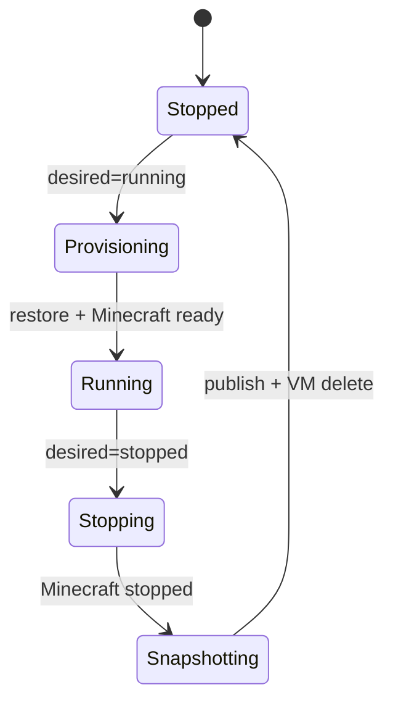

# アーキテクチャ

## システム境界

control plane は Minecraft の `/data` を不透明なデータとして扱います。担当するのは、
排他的な実行、restore、正常停止、snapshot 公開、一時 compute の削除です。mod、
plugin、world、`server.properties` の内容は解釈しません。

## Resource

### Server

利用者が管理する永続 resource です。

- 外部操作に使う一意な DNS-label形式の名前と、内部参照用 UUID
- `running` / `stopped` の desired state
- Akamai compute、Minecraft process、storage の設定
- 現在の authoritative snapshot
- optimistic concurrency 用の `generation`

`server.apply` は名前で upsert します。定義変更は停止中だけ許可され、storage backend
と自動割当済み R2 repository は不変です。停止完了後の `server.archive` は Server を
通常一覧と reconcile 対象から外しますが、名前、履歴、snapshot、R2 object は削除しません。

### ServerInstance

reconciler が作る1回分の実行です。Server ごとに active なものは最大1つです。
source snapshot、解決済み設定、fencing token、観測状態、result snapshot を記録します。

### ComputeInstance

1つの ServerInstance を実行する一時 allocation です。本番では Akamai VM、ローカル
検証では child process です。provider resource の所有権は UUID 由来 label と2つの
tag をすべて照合します。

### Snapshot

active ServerInstance の fencing token が一致した場合だけ公開されます。snapshot の
記録と `Server.current_snapshot_id` の更新は1つの SQLite transaction です。

## 状態遷移



queue は反応時間を短縮するだけで、正本は SQLite です。定期 reconcile により通知欠落や
process restart から復旧します。各 reconcile は小さな idempotent operation を1つずつ
進め、失敗は Server 単位で backoff 付き再試行します。

## データの正本

| 状態 | writable data の正本 |
|---|---|
| 停止中 | `Server.current_snapshot_id` が指す R2 snapshot |
| 実行中 | active fenced ServerInstance の `/data` |
| 停止完了 | 新しく公開された R2 snapshot |

書き込み済みデータを持つ VM が snapshot 前に消失した場合、古い snapshot から黙って
再作成しません。データ損失の可能性を明示して停止します。

## R2 と restic

R2 を選んだ Server の repository は control plane が次の形式で決定します。

```text
s3:https://<ACCOUNT_ID>.r2.cloudflarestorage.com/<BUCKET>/servers/<SERVER_NAME>/restic
```

bucket は control plane 全体で1つだけ設定し、Server定義からは変更できません。Server name
は bucket prefix として安全な1〜63文字の小文字DNS labelに制限し、アーカイブ後も再利用
しません。

node agent は `restic cat config` で存在確認し、未作成なら `restic init` を実行します。
すべての restic command は `--insecure-no-password` を使用します。

remote node には mTLS 登録後、その repository prefix だけを read/write できる短期 R2
credential をメモリ上で渡します。Cloudflare API token と parent credential は control
plane にだけ置きます。

## Akamai provider

Server 定義は region、image、instance type、firewall ID を持ちます。global 設定の
allowlist に全項目が含まれる場合だけ作成できます。control plane は作成前に provider
API で存在・利用可能性を確認します。

create response を失っても deterministic label で既存 VM を adopt します。delete response
を失った後の `404` は削除完了として扱います。disk encryption は performance を優先して
明示的に無効化します。

ephemeral node の systemd unit は rootful Podman が必要とする標準的な host access を
許可します。`ProtectSystem=strict` や path ごとの `ReadWritePaths` は Podman の
`/run/libpod`、netavark、image unpack と競合するため使用しません。

## 通信と認証

| Interface | Transport | 用途 |
|---|---|---|
| client API | Unix socket JSON-RPC | `mcserverctl`、将来の bot/UI |
| local agent API | loopback TCP JSON-RPC | ローカル E2E |
| remote agent API | TLS + private client CA | Akamai node |

remote node は秘密鍵を node 内で生成し、一回限りの enrollment token で CSR を提出します。
発行後は mTLS certificate、exact leaf certificate、reconnect token、active
ComputeInstance をすべて照合します。

## 証明書

public server certificate は Certbot が管理します。Rust daemon に ACME client を組み込まず、
証明書取得・renewal は専用ツールへ委譲します。deploy hook が新しい certificate と key の
対応を検証し、control plane を再起動して `ping` を確認します。失敗時は直前の組へ戻します。
