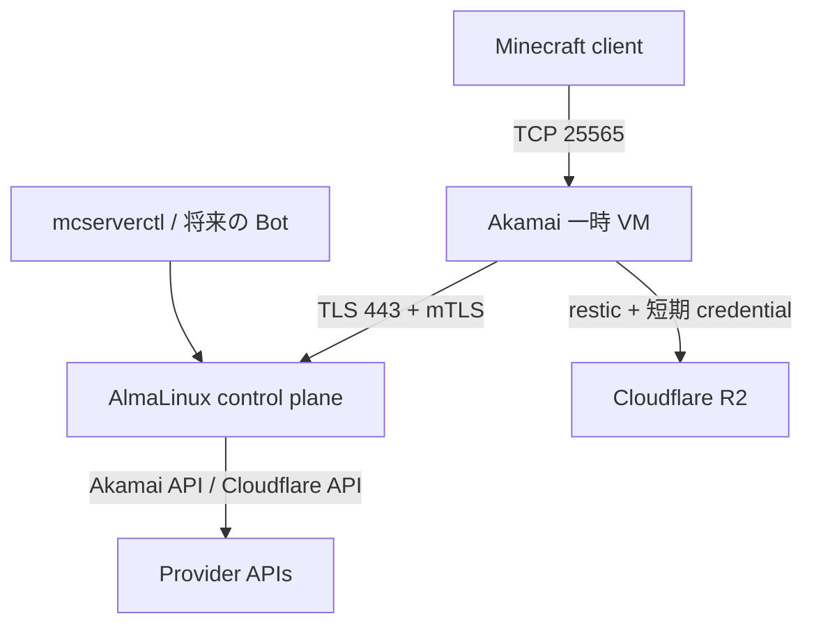

# 本番導入前の外部インフラ

この文書は control-plane host の外で一度だけ用意するものをまとめます。ここを完了して
から [本番導入手順](production-installation.ja.md) へ進みます。

## 全体構成



## 1. control-plane host

次の host を1台用意します。

- AlmaLinux 10、x86-64
- public IPv4
- root または sudo 権限
- systemd
- 永続 disk。SQLite と設定だけを置くため大容量は不要
- 時刻同期が有効

network は次を許可します。

| 方向 | Port | 用途 |
|---|---:|---|
| inbound | TCP 443 | remote node agent |
| inbound | TCP 80 | Certbot standalone の初回発行時だけ |
| inbound | TCP 22 | operator SSH。接続元を制限する |
| outbound | TCP 443 | GitHub、Akamai API、Cloudflare API |
| outbound | DNS/NTP | 名前解決と時刻同期 |

## 2. DNS

agent 用 hostname の `A` record を control-plane host の public IPv4 に向けます。

例:

```text
agent.mcserver.example.org A 203.0.113.10
```

Cloudflare DNS を使う場合も proxy は **DNS only** にします。Cloudflare proxy が TLS を
終端すると、node agent と control plane の direct TLS/mTLS 境界が成立しません。

確認:

```bash
dig +short agent.mcserver.example.org A
```

## 3. Cloudflare R2

1つの専用 bucket を作ります。例では `mcserver` とします。bucket 内の folder や
`production-acceptance` prefix を事前作成する必要はありません。

control plane に必要なのは次の3値です。

- Cloudflare account ID
- R2 temporary access credential を発行できる Cloudflare API token
- temporary credential の親になる R2 access key ID

API token は対象 account と専用 bucket に必要な範囲だけを与えます。control plane は
次の API を呼び出せる必要があります。

```text
POST /client/v4/accounts/<ACCOUNT_ID>/r2/temp-access-credentials
```

親 R2 credential の secret access key は control plane に置きません。長期 S3 access key
も node へ渡しません。deploy 前の preflight が、指定した bucket と parent access key で
短期 credential を実際に発行できることを確認します。

Server 作成後の repository は自動的に次の形になります。

```text
s3:https://<ACCOUNT_ID>.r2.cloudflarestorage.com/<BUCKET>/servers/<SERVER_UUID>/restic
```

restic repository の初期化も node agent が最初の起動時に行います。

公式資料:

- [Cloudflare R2 temporary credentials](https://developers.cloudflare.com/r2/api/s3/temporary-credentials/)
- [Cloudflare API tokens](https://developers.cloudflare.com/fundamentals/api/get-started/create-token/)

## 4. Akamai Cloud

### API token

Personal Access Token を作り、少なくとも次の操作を可能にします。

- Linode instance の list/get/create/delete
- image、region、instance type の参照
- firewall と attached firewall の参照

control plane は firewall を作成・変更・削除しません。

### Firewall

既存の enabled firewall を1つ以上用意します。Minecraft 用には最低限、player の接続元
から TCP 25565 を許可します。SSH を使う場合だけ管理元から TCP 22 も許可します。
outbound は HTTPS、DNS、package download、R2 access が可能である必要があります。

firewall ID は global allowlist と各 Server 定義の両方に記述します。

### 利用可能 resource

使用予定の組合せを決めます。

- region: 例 `jp-tyo-3`
- image: 例 `linode/debian13`
- instance type: 例 `g6-nanode-1`
- firewall ID

image は cloud-init、region は Metadata service に対応している必要があります。deploy
preflight がすべての allowlist 値を provider API で検査します。

### SSH public key

一時 VM へ登録する operator の SSH **公開鍵**を用意します。秘密鍵は control plane
へコピーしません。

## 5. GitHub Release

本番 deploy は source tree をその場で build せず、`v0.2.0` の GitHub Release asset を
検証してインストールします。release は次を満たす必要があります。

- annotated tag `v0.2.0`
- tag が `origin/main` の commit を指す
- static `x86_64-unknown-linux-musl` binaries
- `SHA256SUMS`、build metadata、SBOM、provenance attestation

release 作成は `.github/workflows/release.yml` が行います。

## 完了条件

- agent hostname が control-plane host を返す
- TCP 80/443 の host firewall と上流 firewall が設定済み
- R2 bucket、Cloudflare API token、parent access key ID がある
- Akamai API token、enabled firewall、resource の候補がある
- operator SSH public keyがある
- `v0.2.0` release が公開済み
